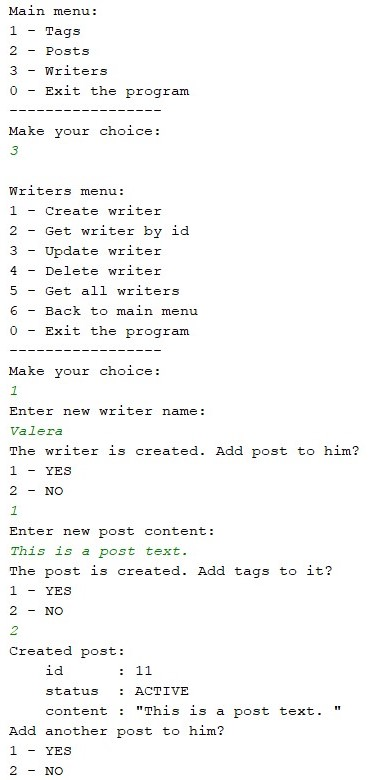

# AppCRUD

**AppCrud** - console CRUD application.

The user in the console has the ability to create, receive, edit and delete data.

#### AppCRUD has the following entities:  
>*- Writer (id, name, List<Post> posts);*  
*- Post (id, content, List<Tag> tags, PostStatus status);*   
*- Tag (id, name);*  
*- PostStatus (enum ACTIVE, DELETED).*

#### Layers:     
> ***model*** - *POJO classes;*   
***repository*** - *classes that implement access to text files;*   
***controller*** - *handling requests from the user;*   
***view*** - *all the data needed to work with the console.*   

The data store is text files: writers.json, posts.json, tags.json.  
The Gson library is used to work with JSON.  
To import dependencies - Maven.

| Console example: |
|:----:|
|  |

#### Инструкции для запуска приложения:

